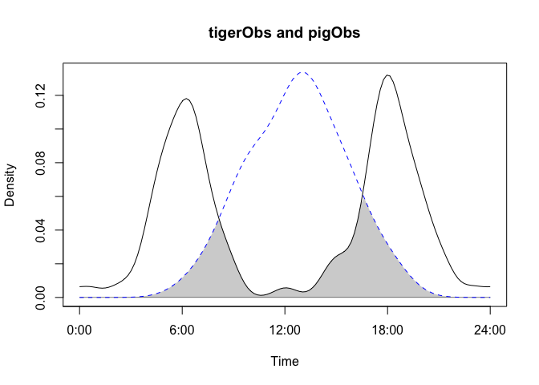
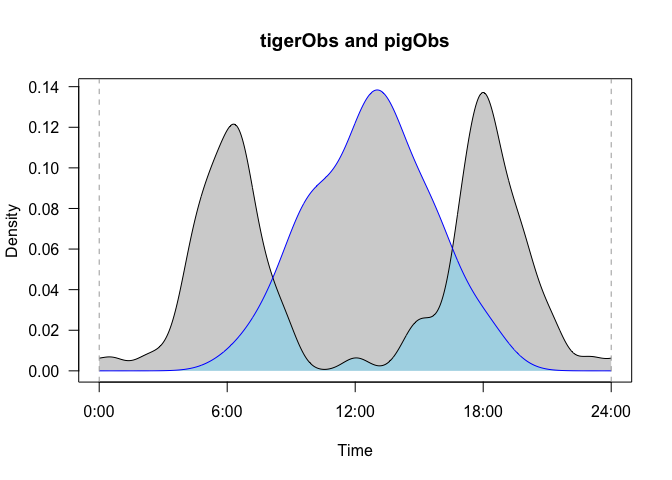
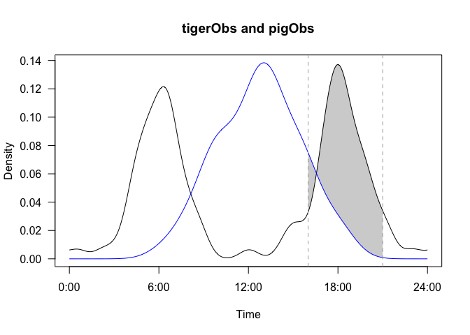

Inference for camera trap data using 'camtrap'.
================
James Henderson
2/20/2017

Introduction
------------

The R package $\\tt{camtrap}$ is built on and extends the capabilities of the $\\tt{overlap}$ package for analyzing time-of-day data as generated by camera traps. The primary extensions are: \* modified functions allowing attention to be focused on a specific time windows, \* the addition of estimates of the area between densities rather than only the overlap, \* the addition of "permutation" tests for testing hypotheses. The following sections are meant to illustrate the use of the added functionality. This documentation and package are both in the early stages of development and not intended for use outside of current collaborators.

Quick Start
-----------

In this section we briefly describe how to get up and running with this package. This is a development version of the package available on git hub. For easy installation, first install and load the $\\tt{devtools}$ package.

``` r
#install.packages('devtools')
library(devtools)
```

You can then install the most recent version of $\\tt{camtrap}$ directly from git hub as indicated in the comments below.

``` r
#install.packages('overlap')
#install_git('git://github.com/jbhender/camtrap/')
library(camtrap)
```

    ## Loading required package: overlap

The $\\tt{overlap}$ is loaded automatically and must be installed prior to installing $\\tt{camtrap}$. The examples in the following section will make use of data from $\\tt{overlap}$.

``` r
data(simulatedData)
head(tigerObs); head(pigObs)
```

    ## [1] 1.621475 1.699564 4.417767 4.616995 4.629183 4.942589

    ## [1] 3.581162 3.615083 3.428990 4.093152 3.171928 3.534832

Overlap and Excess for a Fixed Window
-------------------------------------

The overlap package takes two vectors of observation times in radians, fits densities to each vector, and estimates the area overlap defined as the area under the minimum of the two density functions.

``` r
overlapPlot(tigerObs,pigObs)
```



``` r
overlapEst(tigerObs,pigObs)
```

    ##     Dhat1     Dhat4     Dhat5 
    ## 0.2908618 0.2692011 0.2275000

To focus in on a specific time interval use the following 'window' versions of these functions provided in this package. The time interval of interest is specified using $\\tt{t0}$ and $\\tt{t1}$. These window endpoints should be given on a 24 hour scale and will be scaled interanlly to radians.

``` r
overlapPlotWindow(tigerObs,pigObs,t0=0,t1=24)
```



``` r
overlapEstWindow(tigerObs,pigObs,t0=0,t1=24)
```

    ## $overlap
    ## [1] 0.2908729
    ## 
    ## $excess
    ## [1] -1.206257e-12
    ## 
    ## $window
    ## [1] 0.000000 6.283185

The plotting function currently does not include the full suite of options that $\\tt{overlapPlot}$ does.

Comparing the output of $\\tt{overlapEst}$ and $\\tt{overlapEstWindow}$ you can see that the overlap estimate most closely resembles "Dhat1". Both estimates directly use the area under the fitted density curves, but the version in this package uses adapative quadrature (i.e. $\\tt{integrate}$) in place of a fixed grid.

### Understanding the excess

In addition to estimating the overlap for a fixed user-provided window, the $\\tt{camptrap}$ package also estimates the "excess" defined here to mean the area between the density curves. The $\\tt{type}$ option can be used in $\\tt{overlapPlotWindow}$ to display the excess in place of the overlap.

``` r
overlapPlotWindow(tigerObs,pigObs,t0=16,t1=21,type='excess')
```



``` r
overlapEstWindow(tigerObs,pigObs,t0=16,t1=21)
```

    ## $overlap
    ## [1] 0.1253551
    ## 
    ## $excess
    ## [1] 0.2961325
    ## 
    ## $window
    ## [1] 4.188790 5.497787

Examining the output above, we can say that the difference in the proportions of tiger and pig activity between 16:00 and 21:00 is nearly 30%. As currently computed, the excess gives the difference between the curves. We should consider alternate treatments of this.

Inferece using Permutation Tests
--------------------------------

Based on these images, tigers and pigs clearly follow different patterns of activity. However, in other cases we may wish to assess the signficance of an observed difference relative to a specific null hypothesis. This can be done using the $\\tt{overlapPerm}$ function, which tests against the null hypothesis that the densities generating the two observation vectors are equal during the time requested interval.

``` r
perm <- overlapPerm(tigerObs,pigObs,t0=16,t1=21,nperm=100)
#print.overlapPermObj(perm)
```
